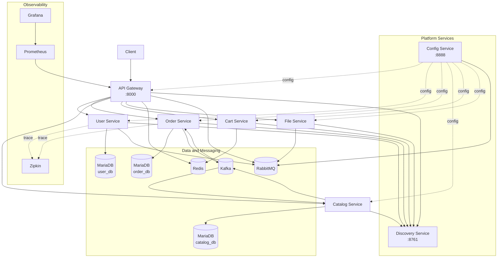

# MSA-Spring-Cloud

실무 도입 가능성이 있는 기술을 탐구하고 검증하기 위해 구현한 Spring Cloud 기반 MSA 커머스 프로젝트.

## 프로젝트 요약

| 항목 | 내용 |
|---|---|
| 검증 범위 | 서비스 분리, 서비스 디스커버리, 중앙 설정, gRPC 조회, Kafka 기반 비동기 보상 |
| 핵심 도메인 | User, Order, Catalog |
| 서비스 구성 | API Gateway, Config Service, Discovery Service, User, Order, Catalog, Cart, File |
| 주요 통신 | REST, gRPC, Kafka Event |
| 운영 구성 | Docker Compose, MariaDB, Redis, RabbitMQ, Zipkin, Prometheus, Grafana |
| 기술 기준 | Java 17, Spring Boot 3.3.x, Spring Cloud 2023.0.x |

## 현재 아키텍처

## 경험한 문제

### 1) 사용자 조회 시 주문 서비스 장애 격리

**문제 인식**

- 사용자 상세 조회 API에서 사용자 기본 정보와 주문 목록을 함께 조회
- `order-service` 장애 발생 시 사용자 기본 정보 응답까지 실패할 위험
- 주문 목록은 부가 데이터이며 사용자 정보는 조회되어야 한다고 판단

**해결 방향**

- 사용자 정보와 주문 목록을 응답 중요도 기준으로 분리
- 주문 목록 조회 구간을 Circuit Breaker로 감싸고 빈 리스트 fallback 적용
- gRPC는 조회 성능 개선 수단으로 두고 장애 격리는 fallback 적용으로 처리

**결과**

- 주문 목록 조회 실패 시 사용자 기본 정보 응답은 유지되도록 fallback 경로 구성
- 실패율과 slow call 기준 및 timeout 정책을 코드로 명시

### 2) 주문-재고 비동기 보상 흐름 검증

**문제 인식**

- 주문 생성은 `order-service`, 재고 차감은 `catalog-service`에서 처리
- `order_db`와 `catalog_db` DB 분리로 단일 트랜잭션 적용 불가
- 재고 차감 실패가 주문 결과에 반영되지 않으면 주문만 성공한 것처럼 남는 정합성 위험 존재

**해결 방향**

- 주문 생성 후 `CATALOG_STOCK_UPDATE` 이벤트를 발행하여 재고 차감 요청
- `catalog-service`에서 상품 존재 여부와 재고 수량을 검증한 뒤 `CATALOG_STOCK_UPDATE_RESULT` 토픽으로 재고 차감 결과 발행
- 실패 결과를 `order-service`가 소비하여 주문 보상 로직 실행
- 재고 차감 요청 이벤트 전송 실패 시 주문 성공 응답을 차단하고 생성된 주문 보상 처리

**결과**

- `CATALOG_STOCK_UPDATE_RESULT` 토픽으로 전달된 재고 차감 결과를 기준으로 주문 보상 흐름 구성
- 재고 부족과 상품 미존재는 `CATALOG_STOCK_UPDATE_RESULT` 토픽의 실패 결과로 주문 생성 결과 보상 처리
- 재고 차감 요청 이벤트가 전송되지 않은 경우 주문이 성공 처리되지 않도록 보상 경로 구성
- 재고 차감 실패 원인을 `StockResultEvent.reason` 필드와 로그에 기록

### 3) Kafka 재고 이벤트 검증

**문제 인식**

- `catalog-service`는 Kafka 메시지를 기준으로 상품 재고를 차감하거나 복원
- JSON 형식 오류 또는 필수 값 누락 시 어떤 주문의 어떤 상품을 처리할지 판단 불가
- 지원하지 않는 `eventType` 처리 시 의도하지 않은 재고 변경 가능

**해결 방향**

- JSON 파싱 실패 시 오류 로그 기록 후 처리 종료
- `orderId`, `productId`, `qty`, `eventType`이 없으면 오류 로그 기록 후 처리 종료
- `CATALOG_STOCK_DECREASE`, `CATALOG_STOCK_RESTORE` 외 이벤트 타입은 경고 로그 기록 후 처리 종료
- 상품 없음 또는 재고 부족 발생 시 `CATALOG_STOCK_UPDATE_RESULT` 토픽으로 실패 결과 발행

**결과**

- 형식이 잘못된 메시지는 재고 변경 로직에 진입하지 않음
- 상품 없음과 재고 부족은 `CATALOG_STOCK_UPDATE_RESULT` 토픽을 통해 `order-service`에 전달
- `CATALOG_STOCK_UPDATE_RESULT` 토픽 발행 실패 시 `KafkaProducer.send()`에서 `IllegalStateException` 발생

## 기술 스택

| 영역 | 기술 |
|---|---|
| Backend | Java 17, Spring Boot 3.3.x, Spring Cloud 2023.0.x |
| Spring Cloud 구성 | Gateway, Eureka, Config Server |
| Data | MariaDB(user/order/catalog), JPA/Hibernate, Redis(gateway/cart) |
| Messaging | Kafka(order/catalog), RabbitMQ(Spring Cloud Bus) |
| Reliability | Resilience4J Circuit Breaker, TimeLimiter(user -> order 조회) |
| Communication | REST, gRPC(user -> order), Protobuf |
| Observability | Actuator, Zipkin(user/order), Prometheus/Grafana 구성 |
| Infra | Docker, Docker Compose |
