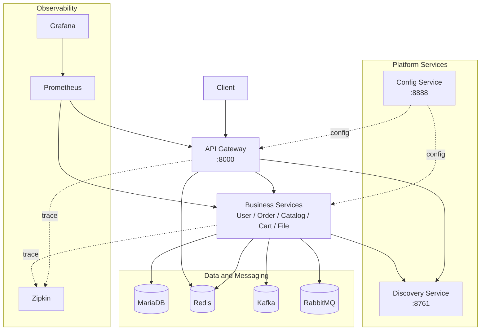

# MSA-Spring-Cloud

> Spring Cloud 기반으로 주문, 상품, 사용자 기능을 서비스별로 분리하고 API Gateway, 서비스 디스커버리, 중앙 설정, 메시지 기반 통신을 연결한 백엔드 프로젝트입니다.

## 프로젝트 소개

해당 프로젝트는 실무 도입 관점에서 기술을 검토하는 데 집중했습니다.

- 사용자 조회 시 외부 gRPC 호출 실패를 Circuit Breaker로 격리하는 방식 검증
- 주문과 재고 처리를 Kafka 메시지 기반으로 분리하는 방식 경험
- 설정 파일과 서비스 코드를 분리해 서비스별 설정 관리 방식 확인

## 핵심 적용 내용

### 1) API Gateway 단일 진입점

- `lb://USER-SERVICE`, `lb://ORDER-SERVICE`, `lb://CATALOG-SERVICE` 라우트를 구성했습니다.
- `RewritePath`, `RemoveRequestHeader=Cookie` 필터로 외부 경로와 내부 서비스 경로를 분리했습니다.
- 사용자, 주문 조회 경로에는 `AuthorizationHeaderFilter`를 적용했습니다.

### 2) 설정 관리 분리

- Config Server로 공통 설정을 분리했습니다.

### 3) 주문과 재고 흐름 분리

- 주문 서비스와 상품 서비스를 Kafka 메시지로 연결했습니다.
- 메시지 payload는 `StockEvent`, `StockResultEvent` DTO를 사용합니다.
- 동기 호출 의존도를 낮추고 서비스 책임을 분리했습니다.

### 4) Circuit Breaker 적용

- 적용 위치: `user-service` 사용자 조회 API의 `order-service` gRPC 호출 구간
- 실패율 임계값: 50
- 느린 호출 비율 임계값: 30
- 느린 호출 기준 시간: 5초
- OPEN 상태 유지 시간: 60초
- fallback 응답: 빈 주문 목록 반환

실패 시 빈 주문 목록으로 대체 응답해 외부 호출 장애가 사용자 조회 전체 실패로 번지지 않게 했습니다.

## 문제 해결 경험

### 1) 외부 호출 실패 전파

- 문제: 사용자 조회 API가 `order-service` gRPC 호출에 직접 의존해, 외부 호출 실패 시 API 전체 실패 위험이 있었습니다.
- 조치: 호출 구간을 `cb-userToOrder-grpc` Circuit Breaker로 감싸고 fallback에서 빈 주문 목록을 반환하도록 처리했습니다.
- 결과: gRPC 오류가 발생해도 사용자 기본 정보 응답은 유지되고, 장애 전파 범위를 주문 정보 조회로 제한했습니다.

### 2) Kafka 메시지 안정성

- 문제: JSON 메시지 파싱 실패, 필수 필드 누락, 지원하지 않는 이벤트 타입이 섞이면 재고 처리 흐름이 불안정해질 수 있었습니다.
- 조치: 수신 메시지를 `StockEvent`로 파싱할 때 예외를 분리 처리하고, `orderId`, `productId`, `qty`, `eventType` 검증을 추가했습니다.
- 조치: 재고 차감 실패 시 원인과 함께 `CATALOG_STOCK_UPDATE_RESULT` 토픽으로 실패 결과 메시지를 발행하도록 구성했습니다.
- 결과: 입력 오류와 비즈니스 실패를 로그와 결과 메시지로 분리해 추적 가능한 형태로 바꿨습니다.

### 3) 보상 처리 흐름

- 문제: 재고 차감 실패 후 주문이 그대로 남으면 주문 상태와 재고 상태가 어긋나는 문제가 생길 수 있었습니다.
- 조치: `order-service`에서 재고 결과 메시지를 소비해 실패 이벤트를 감지하면 `cancelOrder` 보상 로직을 실행하도록 구성했습니다.
- 결과: 재고 실패 케이스에서 주문 보상 처리 경로를 명확히 분리해 정합성 문제를 줄였습니다.

## 시스템 아키텍처



## 요청 흐름

### 1) 사용자 요청 흐름

1. 클라이언트 요청은 `apigateway-service`로 진입합니다.
2. Gateway는 Eureka 등록 정보를 기반으로 대상 서비스를 찾습니다.
3. 각 서비스는 Config Server 설정으로 초기화됩니다.
4. 처리 과정의 trace는 Zipkin에서 확인합니다.

### 2) 주문 처리 흐름

1. 주문 요청은 `order-service`에서 처리합니다.
2. 주문 결과를 Kafka 메시지로 발행합니다.
3. `catalog-service`가 메시지를 소비해 재고 처리를 수행합니다.

## 서비스 구성

| 서비스 | 컨테이너 포트 | 호스트 포트 | 역할 |
|---|---:|---:|---|
| API Gateway | 8000 | 8000 | 단일 진입점, 라우팅, 필터 |
| Config Service | 8888 | 8888 | 중앙 설정 서버 |
| Discovery Service | 8761 | 8761 | 서비스 등록, 서비스 탐색 |
| User Service | 8082 | 랜덤 매핑 | 사용자 도메인 |
| Order Service | 8083 | 랜덤 매핑 | 주문 도메인, 메시지 발행 |
| Catalog Service | 8081 | 랜덤 매핑 | 상품, 재고 도메인, 메시지 소비 |
| Cart Service | 8084 | 랜덤 매핑 | 장바구니 도메인 |
| File Service | 8085 | 랜덤 매핑 | 파일 업로드, 다운로드 |

## 인프라

| 컴포넌트 | 포트 | 용도 |
|---|---|---|
| MariaDB | `3307 -> 3306` | 서비스 데이터 저장 |
| Redis | `6379` | 캐시, 요청 제어 |
| Kafka | `9092`, `9094` | 메시지 브로커 |
| RabbitMQ | `5672`, `15672` | Spring Cloud Bus |
| Zipkin | `9411` | 분산 추적 |
| Prometheus | `9090` | 메트릭 수집 |
| Grafana | `3001` | 대시보드 |

## 실행 방법

### 사전 요구사항

- Docker
- Docker Compose
- Java 17

### 로컬 실행

```bash
# 1. 인프라
docker-compose -f docker-compose-local.yml up -d mariadb redis kafka rabbitmq

# 2. 플랫폼
docker-compose -f docker-compose-local.yml up -d config-service discovery-service

# 3. Gateway
docker-compose -f docker-compose-local.yml up -d apigateway-service

# 4. 비즈니스 서비스
docker-compose -f docker-compose-local.yml up -d user-service order-service catalog-service cart-service file-service

# 5. 모니터링
docker-compose -f docker-compose-local.yml up -d zipkin prometheus grafana
```

## 실행 후 확인 포인트

- API Gateway: `http://localhost:8000`
- Eureka: `http://localhost:8761`
- Config Server: `http://localhost:8888`
- Zipkin: `http://localhost:9411`
- Prometheus: `http://localhost:9090`
- Grafana: `http://localhost:3001` 로그인 `admin/admin`
- RabbitMQ UI: `http://localhost:15672` 로그인 `guest/guest`

## 참고 문서

- 프로젝트 노트: [Spring Cloud MSA Development Notes](https://nickel-painter-d6a.notion.site/msa-spring-cloud-190e2100a14b808a9e99c513edfd6a06)
- Resilience4J: https://resilience4j.readme.io/v2.1.0/docs/circuitbreaker
