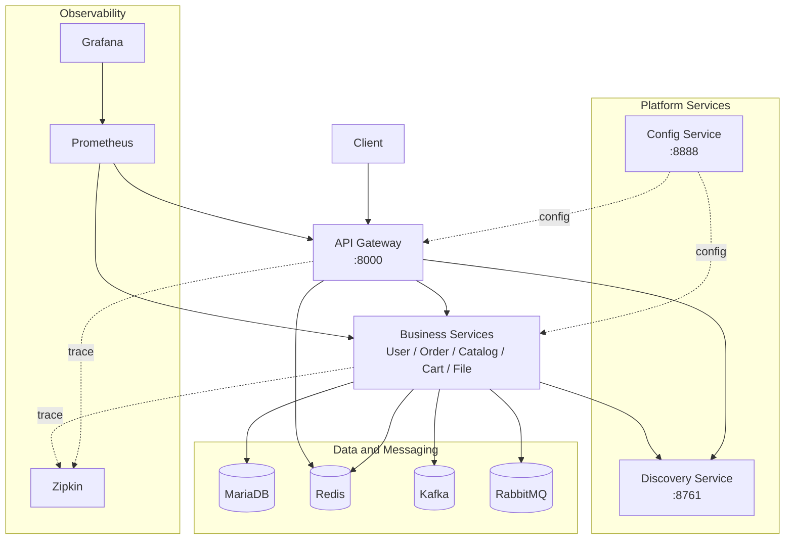

# MSA-Spring-Cloud

Spring Cloud 및 MSA 기반의 커머스 플랫폼을 구현한 백엔드 프로젝트입니다. 

## 프로젝트 요약

| 항목 | 내용 |
|---|---|
| 목표 | Spring Cloud 기반 MSA 구성 요소를 실제 주문/재고 흐름에 적용하고 장애 전파와 데이터 정합성 문제를 해결 |
| 핵심 도메인 | User, Order, Catalog, Cart, File |
| 서비스 구성 | API Gateway, Config Service, Discovery Service, User, Order, Catalog, Cart, File |
| 주요 통신 | REST, gRPC, Kafka Event |
| 운영 구성 | Docker Compose, MariaDB, Redis, RabbitMQ, Zipkin, Prometheus, Grafana |
| 기술 기준 | Java 17, Spring Boot 3.3.x, Spring Cloud 2023.0.x |

## 현재 아키텍처

## 핵심 문제 해결 결과

### 1) 주문 서비스 장애의 사용자 조회 전파 차단

**문제**

사용자 조회 API가 주문 목록 조회를 위해 `order-service`를 호출하므로 주문 서비스 장애가 사용자 기본 정보 조회 실패로 전파될 수 있었습니다.

**조치**

- 사용자 기본 정보와 주문 목록을 응답 중요도 기준으로 분리했습니다.
- 주문 목록 조회 실패 시 사용자 조회 자체를 실패시키지 않고 빈 주문 목록으로 대체했습니다.
- `cb-userToOrder-grpc` Circuit Breaker를 적용해 미처리 장애와 지연 호출에 대한 fallback 경로를 추가했습니다.
- 현재 주문 조회 통신은 성능 개선 목적으로 gRPC를 사용하며, gRPC 호출 예외도 동일한 fallback 정책의 처리 대상에 포함했습니다.

**기술 역할**

- Circuit Breaker/fallback: 장애 전파 차단의 핵심 수단
- gRPC: 주문 조회 통신의 성능 최적화 수단

**결과**

- 주문 조회 실패가 사용자 조회 전체 장애로 번지지 않습니다.
- 장애 영향 범위를 `orders` 필드로 제한했습니다.
- Circuit Breaker 기준을 코드에 명시해 장애 판단 기준을 확인할 수 있게 했습니다.  

### 2) 주문-재고 비동기 보상 흐름 구현

**문제**

주문 저장은 `order-service` DB에서 처리되고 재고 차감은 `catalog-service` DB에서 처리됩니다. 두 서비스가 각자 DB를 소유하므로 하나의 로컬 트랜잭션으로 주문 생성과 재고 차감을 함께 커밋/롤백할 수 없습니다. 이 구조에서 재고 차감 실패 결과를 회수하지 못하면, 재고가 확보되지 않은 주문이 남는 정합성 문제가 생길 수 있었습니다.

**조치**

- `order-service`는 주문 생성 후 재고 차감을 요청하는 `CATALOG_STOCK_UPDATE` 이벤트를 발행합니다.
- `catalog-service`는 이벤트를 소비해 상품 존재 여부와 재고 수량을 검증한 뒤 재고를 차감합니다.
- `catalog-service`는 재고 차감 성공/실패를 `CATALOG_STOCK_UPDATE_RESULT` 이벤트로 다시 발행합니다.
- `order-service`는 결과 이벤트를 소비해 실패 여부를 판단하고, 재고 부족/상품 미존재 같은 실패 결과에서는 `cancelOrder(orderId)`로 주문 생성 결과를 보상 처리합니다.
- Kafka 발행 자체가 실패한 경우에는 `catalog-service`가 재고 차감 요청을 받을 수 없으므로, 생성된 주문도 즉시 보상 처리하고 `503 SERVICE_UNAVAILABLE`을 반환합니다.

**기술 역할**

- Kafka: 주문/재고 서비스를 직접 동기 호출로 묶지 않기 위한 이벤트 전달 수단
- 결과 이벤트: 재고 처리 성공/실패를 주문 서비스가 알 수 있게 하는 피드백 채널
- 보상 로직: 재고 차감 실패 시 주문 생성 결과를 되돌리는 최종 일관성 복구 수단

**결과**

- 재고 차감 요청, 재고 처리 결과, 주문 보상으로 이어지는 이벤트 피드백 루프를 구성했습니다.
- 재고 부족, 상품 미존재, 이벤트 발행 실패 케이스가 조용히 누락되지 않고 보상 경로로 들어가도록 만들었습니다.
- 실패 원인을 결과 이벤트와 로그로 남겨 추적 가능한 비동기 처리 흐름을 만들었습니다.

**구현 범위와 실무 개선 방향**

- 현재 구현은 비동기 Saga 보상 흐름을 검증한 단계입니다.
- 실무 주문 확정 API라면 사용자가 주문 요청 시점에 바로 "재고가 없습니다"를 받을 수 있도록 주문 확정 전에 재고 확인/선점 흐름을 먼저 수행하는 편이 적합합니다.
- 비동기 방식을 유지한다면 주문을 곧바로 확정하지 않고 `PENDING` 상태로 만들고, 재고 결과 이벤트에 따라 `CONFIRMED` 또는 `CANCELED`로 전이시키는 구조가 필요합니다.

### 3) 잘못된 이벤트로 인한 재고 처리 오염 방지

**문제**

비동기 메시지는 JSON 파싱 실패, 필수 필드 누락, 지원하지 않는 이벤트 타입이 섞이면 재고 처리 흐름을 깨뜨릴 수 있습니다.

**조치**

- 수신 메시지를 `StockEvent`, `StockResultEvent`로 역직렬화하고 파싱 실패를 별도로 처리했습니다.
- 재고 처리 전에 `orderId`, `productId`, `qty`, `eventType` 필수 값을 검증했습니다.
- 지원하지 않는 이벤트 타입은 재고 로직으로 진입시키지 않고 경고 로그로 분리했습니다.
- 재고 처리 실패는 결과 이벤트로 응답하고, 예기치 못한 예외는 `unexpected error`로 분리했습니다.
- Kafka 발행은 `ObjectMapper` 재사용, 3초 timeout, interrupt 복구 처리로 보강했습니다.

**기술 역할**

- Kafka: 비동기 메시지 전달 수단
- DTO 검증/예외 분리/발행 실패 처리: 메시지 처리 안정성의 핵심 수단

**결과**

- 잘못된 메시지가 핵심 재고 로직까지 진입하지 않습니다.
- 비즈니스 실패와 메시지 형식 오류를 로그/이벤트에서 구분할 수 있습니다.
- Kafka 발행 실패가 조용히 무시되지 않고 호출자에게 예외로 전파됩니다.

## 주요 흐름

### 사용자 상세 조회

1. Client가 API Gateway로 사용자 상세 조회 요청을 보냅니다.
2. Gateway가 JWT를 검증하고 `X-USER-ID` 헤더를 추가합니다.
3. `user-service`가 사용자 기본 정보를 조회합니다.
4. `user-service`가 성능 개선 목적으로 구성한 gRPC로 `order-service`에 주문 목록을 요청합니다.
5. 주문 목록 호출 실패 시 빈 주문 목록으로 대체해 사용자 기본 정보 응답을 유지합니다.

### 주문 생성과 재고 차감

1. Client가 API Gateway를 통해 주문 생성 요청을 보냅니다.
2. `order-service`가 주문을 저장합니다.
3. `order-service`가 Kafka로 재고 차감 요청 이벤트를 발행한 뒤 클라이언트에 생성 응답을 반환합니다.
4. `catalog-service`가 상품/재고를 검증하고 재고를 차감합니다.
5. `catalog-service`가 성공/실패 결과 이벤트를 발행합니다.
6. 실패 결과를 받은 `order-service`가 주문 생성 결과를 비동기로 보상 처리합니다.

## 기술 스택

| 영역 | 기술 |
|---|---|
| Backend | Java 17, Spring Boot 3.3.x, Spring Cloud 2023.0.x |
| Spring Cloud 구성 | Gateway, Eureka, Config Server |
| Data | MariaDB, JPA/Hibernate, Redis |
| Messaging | Kafka, RabbitMQ |
| Reliability | Resilience4J Circuit Breaker, TimeLimiter |
| Communication | REST, gRPC, Protobuf |
| Observability | Actuator, Micrometer, Zipkin, Prometheus, Grafana |
| Infra | Docker, Docker Compose |
