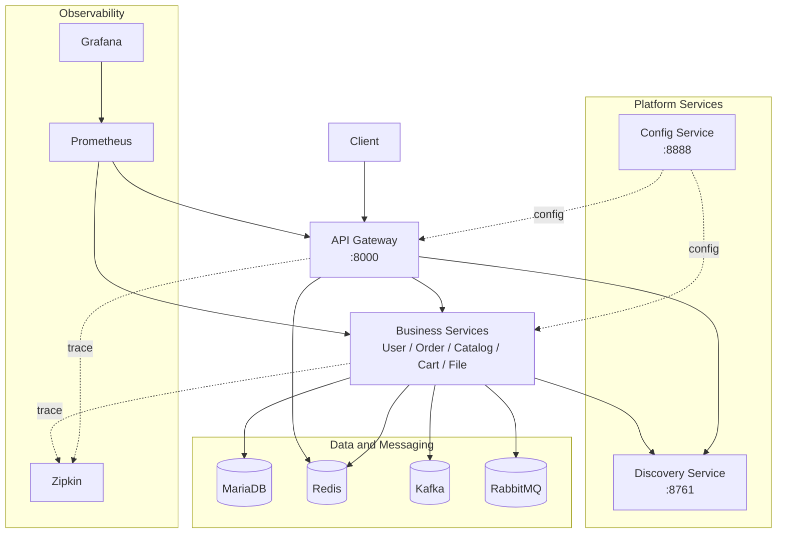

# MSA-Spring-Cloud

Spring Cloud 및 MSA 기반의 커머스 플랫폼을 구현한 백엔드 프로젝트입니다. 

## 프로젝트 요약

| 항목 | 내용 |
|---|---|
| 목표 | Spring Cloud 기반 MSA 구성 요소를 실제 주문/재고 흐름에 적용하고 장애 전파와 데이터 정합성 문제를 해결 |
| 핵심 도메인 | User, Order, Catalog, Cart, File |
| 서비스 구성 | API Gateway, Config Service, Discovery Service, User, Order, Catalog, Cart, File |
| 주요 통신 | REST, gRPC, Kafka Event |
| 운영 구성 | Docker Compose, MariaDB, Redis, RabbitMQ, Zipkin, Prometheus, Grafana |
| 기술 기준 | Java 17, Spring Boot 3.3.x, Spring Cloud 2023.0.x |

## 현재 아키텍처

## 핵심 문제 해결 결과

### 1) 주문 서비스 장애 전파 차단

**문제**

사용자 상세 조회는 사용자 기본 정보와 주문 목록을 함께 응답합니다. 이때 `order-service` 장애가 사용자 기본 정보 조회 실패로까지 번질 수 있었습니다.

**해결**

- 사용자 기본 정보와 주문 목록을 응답 중요도 기준으로 분리했습니다.
- 주문 목록 호출 구간에 Circuit Breaker와 fallback을 적용했습니다.
- 주문 조회 실패 시 사용자 조회는 유지하고 `orders`만 빈 목록으로 대체했습니다.
- gRPC는 주문 조회 통신의 성능 개선 수단이며, 장애 전파 차단의 핵심은 fallback 정책입니다.

**결과**

- 주문 서비스 장애가 사용자 조회 전체 장애로 번지지 않습니다.
- 장애 영향 범위를 주문 목록 필드로 제한했습니다.
- Circuit Breaker 기준을 코드에 명시해 장애 판단 기준을 확인할 수 있게 했습니다.

### 2) 주문-재고 비동기 보상 흐름 구현

**문제**

주문 저장은 `order-service`, 재고 차감은 `catalog-service`가 각각 처리합니다. 서비스별 DB가 분리되어 있어 하나의 로컬 트랜잭션으로 주문 생성과 재고 차감을 함께 롤백할 수 없습니다.

**해결**

- `order-service`는 주문 생성 후 재고 차감을 요청하는 `CATALOG_STOCK_UPDATE` 이벤트를 발행합니다.
- `catalog-service`는 재고 처리 후 성공/실패 결과 이벤트를 다시 발행합니다.
- `order-service`는 실패 결과를 소비하면 주문 생성 결과를 보상 처리합니다.
- Kafka 발행 자체가 실패한 경우에도 생성된 주문을 보상 처리하고 `503`을 반환합니다.

**결과**

- 재고 처리 실패가 조용히 누락되지 않고 주문 보상 경로로 이어집니다.
- 주문 요청, 재고 결과, 주문 보상으로 이어지는 이벤트 피드백 루프를 구성했습니다.
- 실패 원인을 결과 이벤트와 로그로 추적할 수 있습니다.

**구현 범위**

- 현재 구현은 비동기 Saga 보상 흐름을 검증한 단계입니다.
- 실무 주문 확정 API라면 주문 확정 전에 재고 확인/선점을 수행하거나, `PENDING -> CONFIRMED/CANCELED` 상태 전이를 두는 구조가 더 적합합니다.

### 3) 잘못된 이벤트로 인한 재고 처리 오염 방지

**문제**

Kafka 메시지는 비동기로 들어오기 때문에 JSON 파싱 실패, 필수 필드 누락, 지원하지 않는 이벤트 타입이 재고 로직까지 들어갈 수 있었습니다.

**해결**

- 수신 메시지를 DTO로 역직렬화하고 파싱 실패를 별도 처리했습니다.
- 재고 처리 전에 `orderId`, `productId`, `qty`, `eventType`을 검증했습니다.
- 지원하지 않는 이벤트 타입은 재고 로직으로 보내지 않고 로그로 분리했습니다.
- Kafka 발행 실패는 timeout, interrupt 복구, 예외 전파로 조용히 묻히지 않게 했습니다.

**결과**

- 잘못된 메시지가 핵심 재고 로직까지 진입하지 않습니다.
- 메시지 형식 오류와 비즈니스 실패를 구분해 추적할 수 있습니다.
- Kafka 발행 실패가 조용히 무시되지 않고 호출자에게 예외로 전파됩니다.

## 기술 스택

| 영역 | 기술 |
|---|---|
| Backend | Java 17, Spring Boot 3.3.x, Spring Cloud 2023.0.x |
| Spring Cloud 구성 | Gateway, Eureka, Config Server |
| Data | MariaDB, JPA/Hibernate, Redis |
| Messaging | Kafka, RabbitMQ |
| Reliability | Resilience4J Circuit Breaker, TimeLimiter |
| Communication | REST, gRPC, Protobuf |
| Observability | Actuator, Micrometer, Zipkin, Prometheus, Grafana |
| Infra | Docker, Docker Compose |
