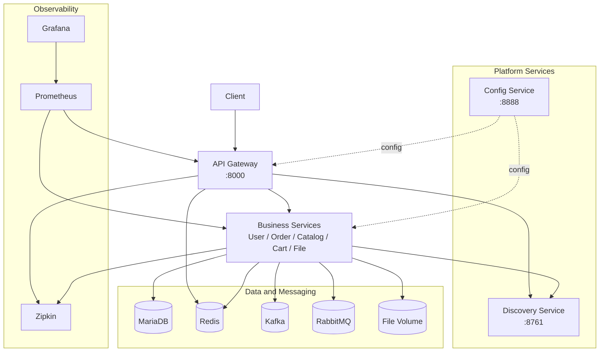

# MSA-Spring-Cloud

> Spring Cloud 기반 마이크로서비스 아키텍처(MSA)를 학습하고, 실무형 운영 요소(비동기 이벤트, 장애 격리, 관측성)를 통합한 포트폴리오 프로젝트입니다.

## 프로젝트 한눈에 보기

- 아키텍처: Spring Cloud Gateway + Eureka + Config Server 기반 MSA
- 핵심 도메인: User, Order, Catalog, Cart, File
- 비동기 통신: Kafka (Order <-> Catalog 이벤트 흐름)
- 운영 구성: Redis, RabbitMQ(Spring Cloud Bus), Zipkin, Prometheus, Grafana
- 실행 기준: `docker-compose-local.yml` (개발), `docker-compose-prod.yml` (배포 템플릿)

## 아키텍처 (현재 구성 반영)

### 시스템 아키텍처 다이어그램



### 아키텍처 포인트

- API 진입점은 `apigateway-service` 하나로 통합되어 있으며, 현재 정적 라우팅은 `user-service`, `order-service`, `catalog-service` 중심으로 설정되어 있습니다.
- 서비스 디스커버리는 `discoveryservice`(Eureka) 기반이며, 각 서비스는 실행 시 레지스트리에 등록됩니다.
- 설정 관리는 `config-service`가 담당하고, Git 저장소 기반 설정 + Spring Cloud Bus(RabbitMQ) 연동 구조를 사용합니다.
- 주문/재고 흐름은 Kafka 기반 비동기 이벤트로 연결됩니다. (`order-service` <-> `catalog-service`)
- 장바구니 데이터와 Gateway Rate Limiting은 Redis를 사용합니다.

## 서비스 구성

| 서비스 | 컨테이너 포트 | 호스트 포트(로컬 compose) | 역할 |
|---|---:|---:|---|
| API Gateway | 8000 | 8000 | 단일 진입점, 라우팅, 인증/인가 필터, Rate Limiting |
| Config Service | 8888 | 8888 | 중앙 설정 서버 |
| Discovery Service | 8761 | 8761 | 서비스 등록/발견 |
| User Service | 8082 | 랜덤(`0:8082`) | 회원/인증 도메인 |
| Order Service | 8083 | 랜덤(`0:8083`) | 주문 도메인, Kafka 이벤트 발행/구독 |
| Catalog Service | 8081 | 랜덤(`0:8081`) | 상품/재고 도메인, Kafka 이벤트 발행/구독 |
| Cart Service | 8084 | 랜덤(`0:8084`) | 장바구니 도메인, Redis 캐시 |
| File Service | 8085 | 랜덤(`0:8085`) | 파일 업/다운로드, WebDAV 연동 |

## 인프라/운영 구성

| 컴포넌트 | 포트 | 용도 |
|---|---|---|
| MariaDB | `3307 -> 3306` | 서비스 데이터 저장 (`user_db`, `order_db`, `catalog_db` 등) |
| Redis | `6379` | 캐시, Rate Limiting |
| Kafka | `9092` (`+9094` 외부 리스너) | 이벤트 브로커 |
| RabbitMQ | `5672`, `15672` | Spring Cloud Bus / 관리 UI |
| Zipkin | `9411` | 분산 추적 |
| Prometheus | `9090` | 메트릭 수집 |
| Grafana | `3001` | 대시보드 시각화 |

## 핵심 기능

### 1) 장애 격리 및 회복력
- Circuit Breaker + Timeout/Fallback으로 장애 전파를 완화
- 서비스 간 의존성 실패 시 사용자 영향 범위를 최소화

### 2) 비동기 이벤트 처리
- 주문 생성/재고 반영을 Kafka 이벤트로 분리하여 결합도 감소
- 동기 API 체인 길이를 줄여 응답 안정성과 확장성 개선

### 3) 성능 최적화
- Redis 캐시(특히 Cart) 적용으로 DB 부하 완화
- Gateway 단에서 Rate Limiting으로 과도한 트래픽 제어

### 4) 운영 가시성
- Micrometer + Prometheus + Grafana 기반 메트릭 관측
- Zipkin Trace로 서비스 간 호출 흐름 추적

## 기술 스택

- Backend: Java 17, Spring Boot 3.3.x, Spring Cloud 2023.0.x
- Data: MariaDB, Redis
- Messaging: Kafka, RabbitMQ
- Infra: Docker, Docker Compose, Jenkins
- Observability: Zipkin, Prometheus, Grafana

## 빠른 시작

### 1) 사전 요구사항

- Docker / Docker Compose
- Java 17+

### 2) 로컬 실행

```bash
# 1. 인프라
docker-compose -f docker-compose-local.yml up -d mariadb redis kafka rabbitmq

# 2. 플랫폼
docker-compose -f docker-compose-local.yml up -d config-service discovery-service

# 3. Gateway
docker-compose -f docker-compose-local.yml up -d apigateway-service

# 4. 비즈니스
docker-compose -f docker-compose-local.yml up -d user-service order-service catalog-service cart-service file-service

# 5. 모니터링
docker-compose -f docker-compose-local.yml up -d zipkin prometheus grafana
```

> 참고: 이 저장소 루트에는 `docker-compose.yml`이 없고, 현재는 `docker-compose-local.yml`, `docker-compose-prod.yml`을 사용합니다.

## 접속 정보

- API Gateway: `http://localhost:8000`
- Eureka: `http://localhost:8761`
- Config Server: `http://localhost:8888`
- Zipkin: `http://localhost:9411`
- Prometheus: `http://localhost:9090`
- Grafana: `http://localhost:3001` (기본 `admin/admin`)
- RabbitMQ UI: `http://localhost:15672` (기본 `guest/guest`)

## 참고/문서

- 프로젝트 노트: [Spring Cloud MSA Development Notes](https://nickel-painter-d6a.notion.site/msa-spring-cloud-190e2100a14b808a9e99c513edfd6a06)
- Spring Cloud: https://spring.io/projects/spring-cloud
- Resilience4J: https://resilience4j.readme.io/v2.1.0/docs/circuitbreaker
- Kafka: https://kafka.apache.org/documentation/
